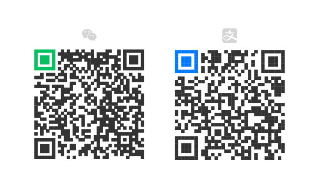

# DragOn

Drag image, text, link... Drop! Supercharge your mouse with drag-and-drop gestures.

## Features

- A highly flexible action system, with 10+ different actions
- Recognition powered by pattern matching and vector similarity
- Customizable gesture trace and status information style

## Limitations

- It does not work on Chrome internal pages like `chrome://extensions` or other restricted pages. This is due to browser security restrictions.
- The page must be partially loaded to perform gestures.
- Pages with Shadow DOM may behave unexpectedly.

## License

This project is licensed under the terms of the [GNU General Public License v3.0](https://github.com/diredocks/DragOn/blob/main/LICENSE).

DragOn wouldn’t be possible without [Gesturefy](https://github.com/Robbendebiene/Gesturefy), [wxt](https://wxt.dev/), [SerenityOS emojis](https://github.com/linusg/serenityos-emoji-font) and other open-source projects.

## Privacy

DragOn does not collect any data of any kind.

* DragOn has no home server.
* DragOn  doesn't embed any analytic or telemetry hooks in its code.

**GitHub** is used to host the DragOn  project. **GitHub, Inc.** (a subsidiary of **Microsoft Corporation**) owns **GitHub** and is unrelated to DragOn.

## Sponsor

Support me via Wechat Pay and Alipay:
